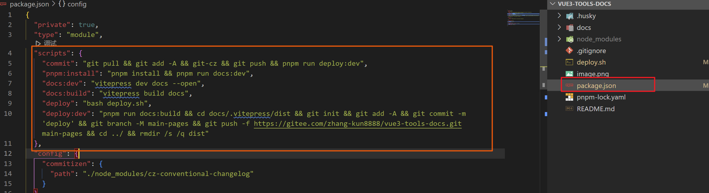
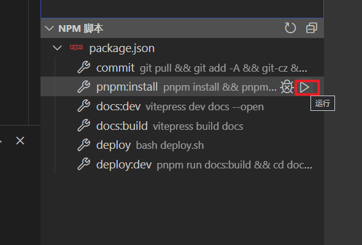

# 📝 NPM 使用文档

## 💡 package.json 脚本说明

- [x] **commit** 实现一键提交并自动部署（git cz 提交检验 配合.husky commit-msg）
- [x] **pnpm:install** 一键安装依赖并运行
- [x] **docs:dev** 一键运行
- [x] **docs:build** 一键打包
- [x] **deploy** 一键部署（终端不可以执行 需要使用 git bash 执行）如 npm run deploy
- [x] **deploy:dev** 一键部署 (终端可以直接执行，可以配置提交脚本，实现一键提交自动部署) 如 npm run deploy:dev

## 🤖 脚本图

